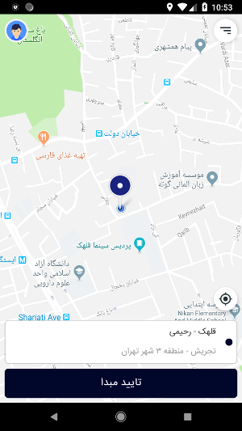
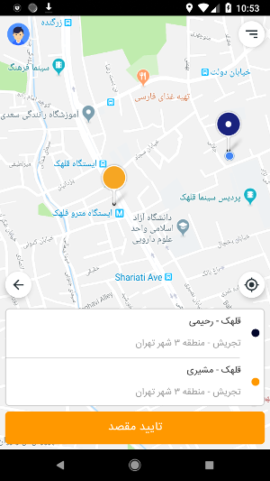

# Astiag test application
this repository is a test application for Astiag company.
This app will show source and destination location and add marker over map. You can back in location. You can show address of places.
this app create with 1 activity and 2 fragment such as : MainFragment, SplasFragment and 2 embed fragment for show location detail.

I have written this project with Kotin and MVVM architecture.

**I used this Major libraries:**
- Android Architecture Components (ViewModel, Navigation controller)
- Dagger2
- RxJava2
- Retrofit2
- Glide
- Timber

# APK file Link:
[Astiag_test_app.apk](app/release/AstiagTest-v1.0.1.apk)

# Preview
 
 
 
